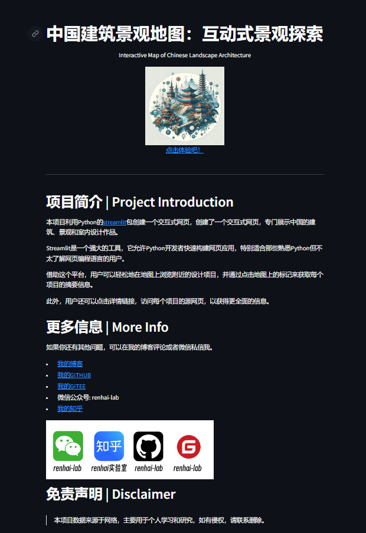
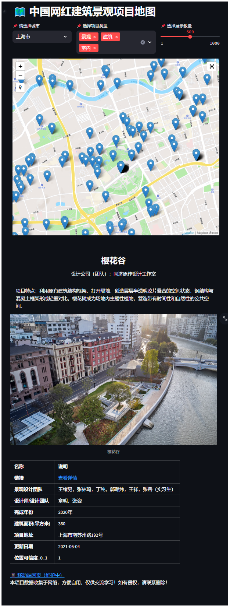
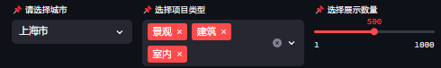

#  中国建筑景观地图：互动式景观探索
> Interactive Map of Chinese Landscape Architecture

本项目利用Python的[streamlit](https://streamlit.io/)包创建一个交互式网页，创建了一个交互式网页，专门展示中国的建筑、景观和室内设计作品。Streamlit是一个强大的工具，它允许Python开发者快速构建网页应用，特别适合那些熟悉Python但不太了解网页编程语言的用户。借助这个平台，用户可以轻松地在地图上浏览附近的设计项目，并通过点击地图上的标记来获取每个项目的摘要信息。此外，用户还可以点击详情链接，访问每个项目的源网页，以获得更全面的信息。

## 一、成果展示 

### 1.网页入口

以下链接直接指向项目的不同部分。如遇加载问题，建议使用代理服务。

#### [（1） 🏠 导航页](https://map_of_chinese_landscape_architecture.streamlit.app/)

  这是项目的主页，提供了项目说明。

  

#### [（2）💻 地图页面](https://map_of_chinese_landscape_architecture.streamlit.app/app_desktop)

 

### 2.地图功能
1. **地图查询**：用户可以在地图上查看不同设计项目的位置，快速获取相关信息。
     基于Mapbox底图，streamlit-folium加载地图组件，[MongoDB Atlas](https://www.mongodb.com/zh-cn/atlas)数据库提供空间数据的查询和储存。

1. **实现对城市、项目类别以及展示数量的筛选**

   

2. **地图的项目点与项目图、项目表格连动展示**

   在地图上选择标记点，会定位到相关项目，并显示对于的项目信息。

3. **chatgpt总结项目特点**

   每个项目特点都是根据chatgpt总结页面得到的。

   

## 写在最后
数据更新时间为2023年9月。

本项目数据收集于网络，方便自用，仅供交流学习！如有侵权，请联系删除！

## TODO
- [x] 优化网页端显示效果
- [x] 解决有些图片未能显示的问题
- [ ] 项目位置反馈
- [ ] 页面载入自定义组件bug
- [ ] 优化地图Marker和底图显示效果

